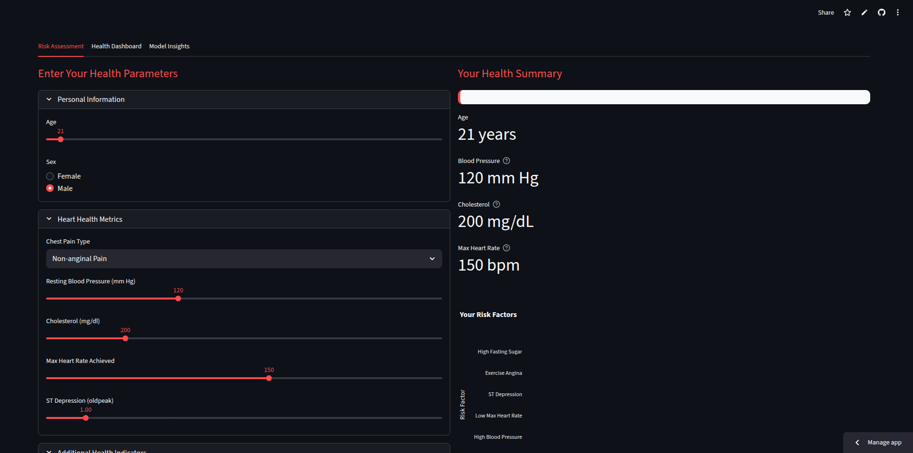
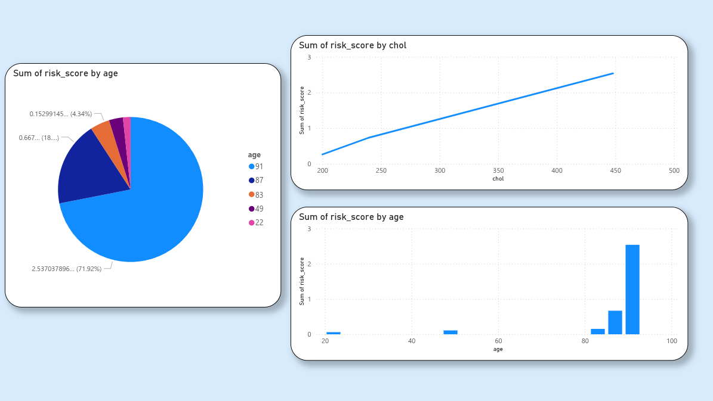

# ❤️ Heart Disease Risk Detector

Interactive Website => [click me](https://heartdetect.streamlit.app/)!






## 📋 Overview
Heart Disease Risk Predictor is a machine learning web application that estimates an individual's risk of heart disease based on health parameters. Built with Streamlit, it provides an intuitive interface for risk assessment with visualizations and personalized recommendations.

## 🚀 Features
Risk Assessment: Input health parameters to get instant heart disease risk prediction

Health Dashboard: Visualize your health metrics with interactive charts

Model Insights: Understand how the ML model works with performance metrics

Personalized Recommendations: Get tailored advice based on your risk level

Responsive Design: Professional UI that works on desktop and mobile devices

## 🛠️ Installation
1. Clone the repository:

```
git clone <your-repo-url>
cd heart-disease-predictor
```

2. Install dependencies:

```
pip install -r requirements.txt
```

## 📁 Project Structure

heart-disease-predictor/ \
├── src/ \
│   ├── main.py                 # Main Streamlit application \
│   └── utils/ \
│       ├── train_model.py      # Model training utilities \
│       └── test_model.py       # Model testing utilities \
├── data/ \
│   └── processed.cleveland.data  # Heart disease dataset \
├── requirements.txt            # Python dependencies \
└── README.md                   # This file 

## 🏃‍♂️ Usage
Run the application with:

```
streamlit run src/main.py
```

The application will open in your default browser at http://localhost:8501.

## 📈 Monitoring & Drift Detection
Daily monitoring compares current holdout metrics to the original training baseline and stores a JSON report in `data/logs/monitor`.

- Script: `src/utils/monitor_model.py`
- Output: `data/logs/monitor/report_YYYY-MM-DD.json` and `data/logs/monitor/latest.json`
- Thresholds: small tolerances for accuracy, precision, recall, ROC AUC, PR AUC
- CI: GitHub Actions workflow `.github/workflows/monitor.yml` runs daily. On drift or failure, it uploads artifacts and opens a GitHub issue with the latest report.

Run locally:

```
python src/utils/monitor_model.py
```

## 📊 Data Source
The model is trained on the Cleveland Heart Disease dataset from the UCI Machine Learning Repository:

Source: https://archive.ics.uci.edu/ml/datasets/Heart+Disease

Samples: 303 patient records

Features: 13 medical attributes

## 🤖 Machine Learning
Algorithm: Random Forest Classifier

Preprocessing: One-hot encoding, feature scaling

Evaluation: Accuracy, Precision, Recall metrics

## ⚠️ Disclaimer
This tool is for informational purposes only and is not a substitute for professional medical advice. Always consult with healthcare providers for proper diagnosis and treatment.
